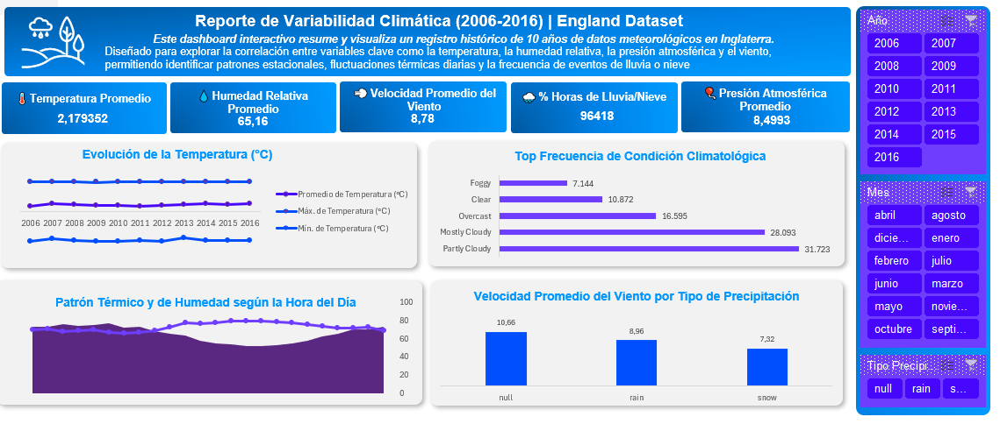

# 🌤️ England Weather Data Analysis & Dashboard (2006 - 2016)

Un proyecto completo de **Business Intelligence y Análisis de Datos Meteorológicos** desarrollado en Excel y Power Query. Este proyecto procesa más de 96,000 registros históricos del clima en Inglaterra para transformar datos brutos en métricas clave y dashboards interactivos.

---

## 📊 Vista General del Proyecto

El conjunto de datos abarca 10 años de mediciones meteorológicas por hora en Inglaterra (2006 a 2016), incluyendo variables como temperatura, humedad, velocidad del viento, presión atmosférica y tipo de precipitación.

### 💡 Objetivos del Proyecto:
1. Limpiar, transformar y estandarizar un dataset masivo en formato CSV.
2. Resolver conflictos de configuración regional (formatos anglosajones vs. hispanohablantes).
3. Diseñar tablas dinámicas estructuradas para el modelado de datos.
4. Crear un dashboard interactivo enfocado en la variabilidad estacional y patrones horarias/anuales.

---

## 🖥️ Explicación del Dashboard

El dashboard fue estructurado con un enfoque visual limpio y jerárquico, diseñado para que cualquier usuario interprete el comportamiento meteorológico de un vistazo.

### 🎯 1. Sección de Tarjetas KPI (Indicadores Clave)
Ubicadas en la parte superior para ofrecer un resumen ejecutivo instantáneo:
- **Temperatura Promedio Global:** Marca la línea base del clima templado oceánico de Inglaterra.
- **Valores Extremos:** Permiten identificar de inmediato la amplitud térmica registrada a lo largo de la década.
- **Humedad Promedio:** Refleja la alta presencia constante de humedad relativa típica de la región.
- **Velocidad del Viento Promedio:** Establece la intensidad media de las corrientes eólicas.

---

### 📈 2. Gráfico de Evolución Temporal Anual (Líneas)
- **Propósito:** Mostrar la tendencia a largo plazo entre 2006 y 2016.
- **Estructura:** Compara tres líneas paralelas: *Temperatura Máxima*, *Temperatura Promedio* y *Temperatura Mínima* por cada año.
- **Insight Clave:** Revela la estabilidad del promedio anual (alrededor de los $11\text{–}12\text{ °C}$), destacando picos atípicos en años específicos como 2007 u olas de frío en 2012.

---

### 📊 3. Gráfico Combinado Diario (Comportamiento por Hora: 00 hs a 23 hs)
- **Propósito:** Analizar la fluctuación del clima a lo largo de un ciclo de 24 horas.
- **Estructura de Doble Eje:**
  - **Eje Izquierdo (Línea Cálida):** Muestra la *Temperatura Promedio* por hora.
  - **Eje Secundario Derecho (Área/Línea Azul):** Muestra la *Humedad Promedio* ajustada de $0\%$ a $100\%$.
- **Insight Clave:** Evidencia la **correlación inversa** entre ambas variables. Durante la madrugada (0 a 6 hs) la temperatura cae a su punto más bajo mientras la humedad roza su pico ($86\text{–}87\%$). Entre las 12 y las 16 hs, la temperatura alcanza su máximo diario y la humedad disminuye significativamente.

---

### 🎛️ 4. Filtros Interactivos (Segmentadores de Datos / Slicers)
- Permiten filtrar todo el dashboard en tiempo real por **Año**, **Mes** o **Tipo de Precipitación** (*Rain/Snow*), dinamizando el análisis estacional.

---

## ⚙️ Proceso de ETL (Extract, Transform, Load)

El apartado de ETL fue crucial en este proyecto debido a las discrepancias entre formatos culturales de datos.

### 1. Extracción (Extract)
- **Fuente de Datos:** Archivo `EnglandWeather.csv` (más de 96,400 filas).
- **Campos Importados:** `Formatted Date`, `Summary`, `Precip Type`, `Temperature (C)`, `Wind Speed (km/h)`, `Pressure (millibars)`, `Humidity`.

### 2. Transformación (Transform) & Resolución de Errores Regionales
- **Problema de Separador Decimal (Punto vs. Coma):**
  - Al importar un CSV con formato anglosajón (`.` como decimal, ej. `9.472222`) a un sistema operativo o Excel en español (donde `,` es decimal y `.` es separador de miles), los valores se interpretaban como números enteros gigantes de hasta 10 dígitos (ej. `9472222222`).
- **Solución Aplicada en Power Query:**
  - Se configuró el tipo de dato mediante **Configuración Regional (*Locale*)** especificando **`Inglés (Estados Unidos)`** en las columnas numéricas (`Temperature (C)`, `Wind Speed`, `Pressure`, `Humidity`).
  - Esto aseguró que el punto fuera reconocido correctamente como punto decimal antes de la conversión al formato numérico local.
- **Formateo y Limpieza de Datos:**
  - Redondeo de métricas como `Temperature (C)` a **2 decimales** (`Number.Round(_, 2)`).
  - Normalización de la columna `Formatted Date` para extraer componentes de **Año**, **Mes** y **Hora del Día (0 a 23 hs)**.
  - Conversión del campo `Humidity` a formato de porcentaje (`0.00` a `1.00` $\rightarrow$ `0%` a `100%`).

### 3. Carga (Load)
- Carga optimizada hacia el modelo de datos de Excel y la hoja de soporte de **Tablas Dinámicas** (`tablas`), optimizando el rendimiento para permitir segmentadores (*Slicers*) en tiempo real.

---

## 🛠️ Tecnologías y Herramientas

- **Excel:** Modelado de datos, Tablas Dinámicas, Formato Condicional y Visualización.
- **Power Query (M):** Limpieza, transformación de datos y manejo de configuración regional.
- **Git / GitHub:** Control de versiones y documentación.
