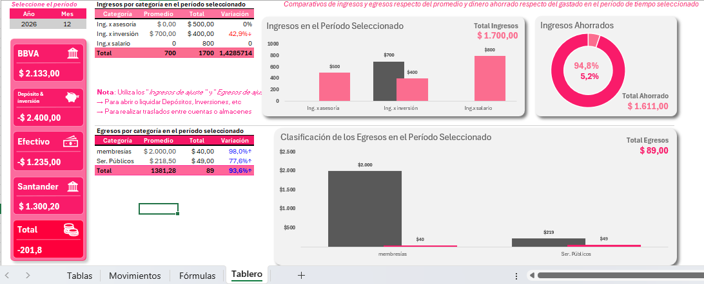

# 💰 Sistema de Control de Finanzas Personales en Excel



Un modelo integral, automatizado y dinámico desarrollado en Microsoft Excel para la gestión centralizada de ingresos, egresos, saldos por cuenta y control presupuestario personal.

---

## 📌 Descripción del Proyecto

El **Sistema de Control de Finanzas Personales** permite registrar, categorizar y analizar la evolución del patrimonio personal y el flujo de caja dinámicamente. 

El modelo resuelve la trazabilidad de fondos a través de múltiples cuentas/almacenes (cuentas bancarias, efectivo, inversiones) y ofrece un **Tablero de Control (Dashboard)** interactivo para la evaluación periódica de gastos e ingresos en comparación con promedios históricos.

---

## 🛠️ Funcionalidades Principales

* **Centralización de Cuentas y Almacenes:** Control individualizado y consolidado del saldo disponible en bancos (ej. BBVA, Santander), efectivo e inversiones.
* **Clasificación por Categorías:** Mapeo de ingresos (salario, asesorías, inversiones) y egresos (servicios, alquiler, educación, despensa, etc.).
* **Gestión de Transferencias e Inversiones:** Utilización de categorías de *Ajuste* para registrar transferencias entre cuentas, aperturas/liquidaciones de depósitos e inversiones sin distorsionar el balance global de ingresos y egresos.
* **Matriz de Control Mensual:** Consolidación mensual automatizada de gastos por categoría para identificar desviaciones del presupuesto.
* **Dashboard Interactivo:** Selección dinámica por Año y Mes para visualizar la variación porcentual de gastos e ingresos respecto a promedios.

---

## 📐 Estructura del Libro de Trabajo

El libro está estructurado funcionalmente en 4 pestañas:
├── Tablas       --> Parámetros, maestros de categorías y cuentas/almacenes.
├── Movimientos  --> Bitácora general para el registro de transacciones.
├── Fórmulas     --> Matriz de cálculo, balance por cuenta y desglose mensual.
└── Tablero      --> Dashboard interactivo de análisis visual y métricas claves.

### 1. Pestaña `Tablas`
Contiene la parametrización del sistema (IDs de movimiento, tipos de categoría y lista de almacenes de dinero).

### 2. Pestaña `Movimientos`
Libro diario de registro operacional.

| Columna | Descripción / Tipo de Dato |
| :--- | :--- |
| `Fecha` | Fecha exacta del movimiento. |
| `Categoría` | Categoría asignada (desplegable). |
| `Detalle` | Descripción del concepto. |
| `Almacén` | Cuenta bancaria o medio de pago utilizado. |
| `Valor` | Monto del movimiento. |
| `Categoría Tabla` | Indicador automático de flujo (`1` para Ingreso / `-1` para Egreso). |

### 3. Pestaña `Fórmulas`
Estructura de backend analítico que consolida:
* **Balance General:** Saldos en tiempo real por cada almacén/cuenta.
* **Egresos Mensuales:** Matriz cruzada por categoría y período (*2026-01, 2026-02, etc.*).

### 4. Pestaña `Tablero` (Dashboard)
Panel de control con selectores dinámicos por período que calcula totales, promedios y variaciones porcentuales.

---

## 🧠 Fórmulas y Lógica Aplicada

El dinamismo del modelo se basa en funciones avanzadas de búsqueda y suma condicional con **referencias de tablas estructuradas**:

* **Determinación de Signo por Categoría (Ingreso vs. Egreso):**
  ```excel
  =SI(
    SI.ERROR(
      BUSCARX(
        Movimientos[[#Esta fila],[Categoría]], 
        tCategorias[Nombre], 
        tCategorias[Id.Movimiento]
      ), 
      0
    ) = 1, 
    1, 
    -1
  )
  ```

* **Consolidación de Saldos por Almacén / Cuenta:**
  ```
  =SUMAR.SI.CONJUNTO(
    tMovimientos[Valor], 
    tMovimientos[Almacén], 
    tAlmacen[[#Esta fila],[Almacén]], 
    tMovimientos[Categoría Tabla Movimientos], 
    1
  ) 
  - 
  SUMAR.SI.CONJUNTO(
    tMovimientos[Valor], 
    tMovimientos[Almacén], 
    tAlmacen[[#Esta fila],[Almacén]], 
    tMovimientos[Categoría Tabla Movimientos], 
    -1
  )
  ```

**Desglose Mensual por Categoría (SUMAR.SI.CONJUNTO con filtrado por fecha):**
Aplica criterios combinados de categoría, año y mes sobre la bitácora de movimientos para poblar la matriz del presupuesto.

🚀 Cómo Utilizar este Repositorio
  * Clona o descarga el archivo sistema_de_finanzas_personales.xlsx.
  
  * Personaliza tus cuentas bancarias y categorías en la pestaña Tablas.
  
  * Registra tus gastos e ingresos diarios en la pestaña Movimientos.
  
  * Consulta el saldo de tus cuentas en la pestaña Fórmulas o analiza tus períodos en el Tablero.

👤 Autora
* **Carola Donadio**
* **Estudiante de la Tecnicatura Superior en Ciencia de Datos e IA (Instituto N°57)**
