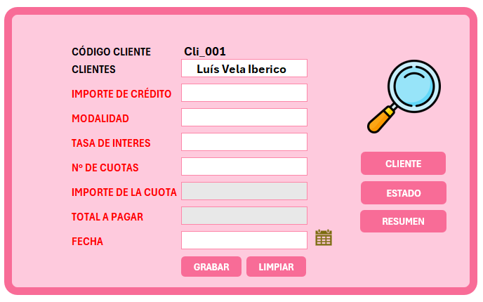

# 🏦 Sistema de Gestión de Préstamos en Excel



Sistema automatizado en Excel (`.xlsm`) diseñado para el control, cálculo y seguimiento integral de préstamos, cuotas, clientes y pagos.

---

## 📌 Estructura del Libro de Trabajo

```text
├── CLIENTE      --> Registro y maestro de clientes con búsqueda interactiva.
├── CALCULADORA  --> Generador de cronograma de pagos y simulación de préstamos.
├── ESTADO       --> Control de cuotas, seguimiento de mora, alertas y estado de pago.
├── RESUMEN      --> Consolidado general por préstamo, saldo pendiente y ganancias.
└── LISTAS       --> Tablas auxiliares de configuración (modalidades, frecuencias).
```

## ⚡ Características Principales
* **Gestión de Clientes:** Base de datos centralizada con códigos automáticos e información de contacto.

* **Simulador y Calculadora:** Generación automática de amortización según modalidad (Diaria, Quincenal, Mensual, Anual).

* **Seguimiento de Pagos:** Monitoreo en tiempo real del estado de cada cuota (PAGADO, PENDIENTE, alertas de mora).

* **Tablero de Resumen:** Indicadores consolidados sobre monto prestado, total cobrado y deuda pendiente por cliente.

## 🛠️ Módulos y Pestañas

### 1. 👤 Maestro de Clientes (`CLIENTE`)
- **Gestión de datos:** Registro de código único (`Cli_001`), nombre completo, DNI, dirección y número de teléfono.
- **Búsqueda rápida:** Filtros dinámicos para localización instantánea de clientes.

### 2. 🧮 Calculadora de Préstamos (`CALCULADORA`)
- **Simulador:** Ingreso de código de cliente, monto otorgado, tasa de interés y cantidad de cuotas.
- **Frecuencias de cobro:** Configuración por modalidades (Diario, Quincenal, Mensual, Anual).
- **Generación automática:** Crea la tabla de amortización con importes exactos y desglose de cuotas.

### 3. 📅 Estado de Cuotas (`ESTADO`)
- **Control diario:** Muestra cada cuota por cliente con su fecha de vencimiento e importe.
- **Registros:** Fecha real de pago, cálculo de **mora** y **alertas de vencimiento**.
- **Estados:** Monitoreo visual entre cuotas `PAGADO` y `PENDIENTE`.

### 4. 📊 Resumen Financiero (`RESUMEN`)
- **Vista general:** Matriz por código de préstamo (`COD PRESTAMO`).
- **Métricas financieras:** Total otorgado, tasa aplicada, monto cobrado a la fecha, ganancias/intereses y cuotas restantes.

---

## 🔄 Flujo de Trabajo del Usuario

1. **Registrar Cliente:** Alta en la pestaña `CLIENTE`.
2. **Generar Crédito:** Ir a `CALCULADORA`, elegir cliente, definir importe, cuotas y modalidad. Generar el préstamo.
3. **Controlar Pagos:** Ir a `ESTADO` para registrar las fechas de pago a medida que los clientes abonan sus cuotas.
4. **Analizar Resultados:** Revisar en `RESUMEN` el saldo global y la rentabilidad obtenida.

---

## 💻 Requisitos e Instalación

### Requisitos
- **Microsoft Excel** (versión 2016 o posterior compatible con macros `.xlsm`).
- Habilitar la ejecución de macros/VBA al abrir el documento.

### Pasos de apertura
1. Descarga o clona el repositorio.
2. Abre el archivo `sistema_de_gestion_de_prestamos1.xlsm`.
3. Al abrir, haz clic en **"Habilitar contenido"** en la barra amarilla superior para activar los botones interactivos y las macros.
