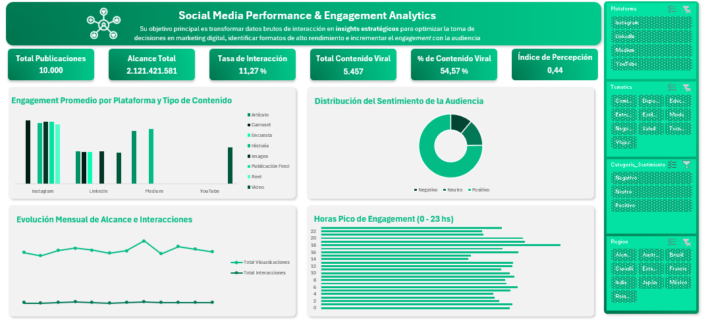

# 📊 Social Media Performance & Engagement Analytics

Un proyecto end-to-end de **Business Intelligence y Analítica de Redes Sociales** desarrollado en **Excel, Power Query, Power Pivot (DAX) y Tablas Dinámicas**. 

El objetivo principal de este proyecto es transformar un conjunto de datos masivo (~10,000 publicaciones) en un **Dashboard interactivo, dinámico y ejecutivo** que permita evaluar el impacto de los contenidos, identificar las mejores prácticas por plataforma y optimizar las estrategias de marketing digital.


---

## 🛠️ Tecnologías y Herramientas Utilizadas

* **Excel**: Interfaz del Dashboard, maquetación visual y segmentadores interactivos.
* **Power Query**: Pipeline de Extracción, Transformación y Carga (ETL) y limpieza de datos.
* **Power Pivot**: Modelado de datos multidimensional e implementación de lenguaje **DAX (Data Analysis Expressions)**.
* **Markdown**: Documentación del proyecto para el repositorio de GitHub.

---

## 🔄 PARTE 1: Pipeline de ETL (Extracción, Transformación y Carga)

El flujo de trabajo en **Power Query** se diseñó para limpiar, normalizar y enriquecer los datos provenientes del dataset original (`social_media_performance.csv`).

### 1. Extracción y Manejo de Configuración Regional
* **Importación:** Archivo estructurado CSV con 10,000 registros y codificación `UTF-8`.
* **Configuración Regional:** Se aplicó explícitamente el locale `Inglés (Estados Unidos)` a las columnas numéricas con punto decimal (`engagement_rate` y `sentiment_score`). Esto previno errores de truncamiento donde los decimales eran leídos como enteros por la configuración regional predeterminada en español.

### 2. Transformaciones y Limpieza de Datos
* **Traducción y Estandarización de Atributos:**
  * `platform` $\rightarrow$ `Plataforma` (*LinkedIn, Instagram, YouTube, Medium*)
  * `content_type` $\rightarrow$ `Tipo_Contenido` (*Reel, Artículo, Encuesta, Imagen, Carrusel, Video*)
  * `topic` $\rightarrow$ `Tematica` (*Technology, Health, Business, Sports, Travel, Fashion, Food*)
  * `region` $\rightarrow$ `Region`
  * `language` $\rightarrow$ `Idioma`
* **Desglose Temporal Dinámico:**
  * Creación de columnas derivadas a partir de `post_datetime`: `Fecha`, `Año`, `Mes`, `Dia_Semana` y `Hora_Del_Dia` (de 0 a 23 hs) para permitir análisis de estacionalidad y horarios pico.
* **Categorización Condicional de Sentimiento:**
  * Implementación de una columna condicional `Categoria_Sentimiento` basada en `sentiment_score`:
    * `Positivo`: Puntaje $> 0.2$
    * `Neutro`: Puntaje entre $-0.2$ y $0.2$
    * `Negativo`: Puntaje $< -0.2$
* **Creación de Métricas Derivadas a Nivel de Fila:**
  * `Total_Interacciones` = `likes` + `comments` + `shares`
  * `Cantidad_Hashtags` = Calculado en M mediante la diferencia de longitud de texto:
    ```powerquery
    (Text.Length([hashtags]) - Text.Length(Text.Replace([hashtags], "#", "")))
    ```

### 3. Carga Eficiente
* Se configuró el destino de carga como **"Crear únicamente conexión"** y **"Agregar estos datos al Modelo de Datos"**, evitando tablas planas pesadas en la hoja de cálculo y optimizando el consumo de memoria.

---

## 📐 PARTE 2: Modelo de Datos y Medidas DAX

Los datos procesados se cargaron en el **Modelo de Datos de Power Pivot**, donde se definieron **Medidas DAX** dinámicas que recalculan su valor en tiempo real según los filtros activos.

| Nombre de la Medida | Fórmula DAX | Descripción / Formato | Valor Global |
| :--- | :--- | :--- | :--- |
| **`Total Publicaciones`** | `COUNTROWS(Fact_Publicaciones)` | Conteo total de posts analizados. | `10.000` |
| **`Total Visualizaciones`** | `SUM(Fact_Publicaciones[views])` | Suma del alcance global. | `2.121.421.581` (~2.12B) |
| **`Total Interacciones`** | `SUM(Fact_Publicaciones[Total_Interacciones])` | Suma de likes, comentarios y compartidos. | `234.407.740` |
| **`Engagement Promedio`** | `AVERAGE(Fact_Publicaciones[engagement_rate])` | Tasa de interacción media por post. | `11,27%` |
| **`Publicaciones Virales`** | `CALCULATE(COUNTROWS(Fact_Publicaciones); Fact_Publicaciones[is_viral] = 1)` | Conteo de posts catalogados como virales. | `5.457` |
| **`% Viralidad`** | `DIVIDE([Publicaciones Virales]; [Total Publicaciones]; 0)` | Proporción de contenido viral. | `54,57%` |
| **`Sentimiento Promedio`** | `AVERAGE(Fact_Publicaciones[sentiment_score])` | Puntuación media de tono (-1 a 1). | `0,44` |

---

## 📈 PARTE 3: Dashboard Interactivo y Visualizaciones

El Dashboard se construyó en una hoja dedicada (`Dashboard`), desvinculando la capa de presentación de la capa de cálculo (`Tablas_Dinamicas`).

### Componentes Clave de la Interfaz:
1. **Tarjetas de KPI Top-Level:**
   * Conectadas dinámicamente a celdas respaldadas por medidas DAX.
2. **Gráficos Dinámicos Personalizados:**
   * **Engagement por Plataforma y Formato:** Permite identificar la combinación óptima de canal y formato (ej. Reels en Instagram vs. Artículos en LinkedIn).
   * **Distribución de Sentimiento (Anillo):** Formateado con código de colores semántico.
   * **Evolución Mensual:** Tendencia temporal con líneas y marcadores personalizados para detectar picos estacionales.
   * **Horas Pico (0-23 hs):** Revela la ventana horaria de mayor receptividad de la audiencia para la programación automatizada de contenidos.
3. **Segmentadores de Datos (Slicers):**
   * Configurados con **Conexiones de Informe** cruzadas hacia todas las Tablas Dinámicas, permitiendo una experiencia de usuario (UX) interactiva e instantánea.

---

## 💡 Principales Conclusiones / Insights del Negocio

1. **Rendimiento Promedio:** El dataset muestra un *Engagement Rate* promedio saludable del **11.27%**, superando el promedio estándar de la industria.
2. **Alto Índice de Viralidad:** El **54.57%** de los contenidos logran un alcance masivo, impulsados principalmente por temas de *Tecnología* y *Negocios*.
3. **Salud de Marca:** La percepción general del público es predominantemente favorable, con un puntaje de sentimiento promedio de **0.44** y más del **54%** de interacciones clasificadas en la categoría *Positivo*.
