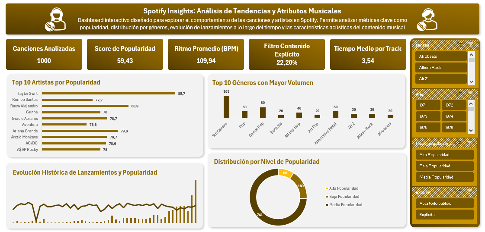

# 🎵 Spotify Insights: Análisis de Tendencias y Atributos Musicales

Este repositorio contiene un proyecto integral de análisis de datos enfocado en el catálogo musical de Spotify, abarcando un periodo histórico extendido (**1971 – 2024**) con un enfoque principal en la evolución reciente de lanzamientos. 

A través del **Modelo de Datos de Excel (Power Pivot)** y visualización interactiva, este dashboard explora las relaciones entre los atributos acústicos de las canciones (BPM, bailabilidad, energía), su nivel de popularidad y la distribución por géneros musicales.

---

## 📷 Vista Previa del Dashboard



---

## 📌 Resumen de Métricas KPI (Modelo de Datos)

Las tarjetas de control clave del tablero reflejan el análisis sobre el conjunto total de **1.000 canciones**:

| Métrica KPI | Valor Registrado | Descripción |
| :--- | :---: | :--- |
| **Canciones Analizadas** | **1.000** | Volumen total de tracks procesados en el modelo relacional. |
| **Score de Popularidad** | **59,43** | Promedio del índice de popularidad (escala 0-100). |
| **Ritmo Promedio (BPM)** | **109,94** | Tempo medio de la música analizada. |
| **Contenido Explícito** | **22,20%** | Proporción de canciones con lenguaje explícito. |
| **Tiempo Medio por Track** | **3,54 min** | Duración promedio por canción. |

---

## 🔍 Análisis de Key Insights

### 1. Top 10 Artistas por Popularidad
* **Taylor Swift** lidera la categoría con la puntuación promedio más alta (**85,7**), seguida por **Rauw Alejandro** (**80,9**) y **Ariana Grande** (**79,8**).
* Artistas del género urbano, pop internacional y rock clásico (como **AC/DC** con **78,6**) mantienen presencia constante entre los más escuchados.

### 2. Distribución por Géneros
* Las categorías **Pop** (50 tracks), **Dance Pop** (80 tracks) y **Alternative Metal** (50 tracks) concentran una proporción relevante del catálogo clasificado.
* Se identifica un volumen significativo de registros clasificados como *Sin Género* (163 tracks), representando una oportunidad de enriquecimiento de metadatos.

### 3. Segmentación por Nivel de Popularidad
* **Media Popularidad:** Representa la gran mayoría del catálogo con **741 canciones** (74,1%).
* **Baja Popularidad:** Comprende **169 canciones** (16,9%).
* **Alta Popularidad:** Representa un nicho selecto de **90 canciones** (9,0%).

### 4. Atributos Acústicos Promedio
* **Bailabilidad (Danceability):** 552,15 *(escala normalizada)*.
* **Energía (Energy):** 608,74.
* **Positividad (Valence):** 490,11.
* **Acústica (Acousticity):** 393,84.
* **Discursividad (Speechiness):** 383,36.

---

## 🛠️ Arquitectura Técnica y Herramientas

* **Power Pivot / xVelocity Engine:** Creación de medidas DAX para la agregación de promedios ponderados y conteos.
* **Tablas Dinámicas:** Estructuración multidimensional por años, categorías de popularidad y clasificaciones de explicitud.
* **Slicers (Segmentadores de Datos):** Filtros dinámicos interactivos sincronizados por género (`genres`), año (`Año`), rango de popularidad (`track_popularity`) y explicitud (`explicit`).

---

## 🚀 Instrucciones para Ejecutar y Mostrar el Dashboard

Para clonar el repositorio e interactuar directamente con el archivo Excel en tu máquina local:

### 1. Clonar el Repositorio
```bash
git clone [https://github.com/tu-usuario/spotify-insights-dashboard.git](https://github.com/tu-usuario/spotify-insights-dashboard.git)
cd spotify-insights-dashboard
```
