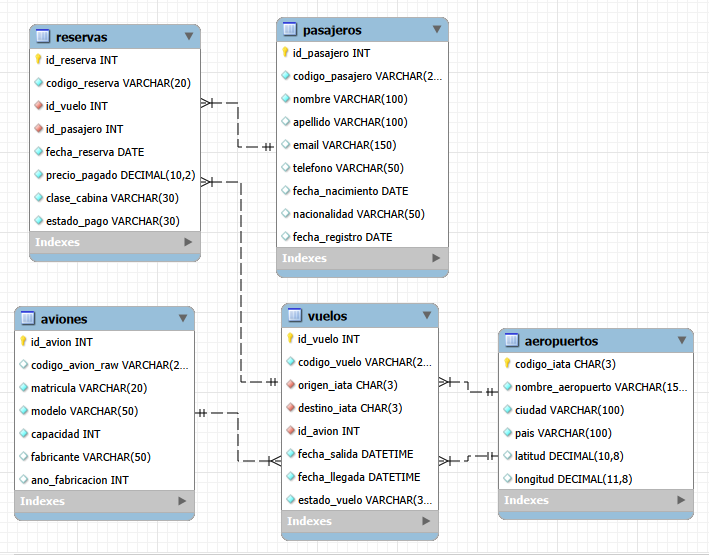

# ✈️ Proyecto ETL & Data Warehouse: Análisis de Reservas Aéreas

Este repositorio contiene la solución técnica integral para el procesamiento, limpieza, modelado y analítica de datos operacionales en el sector aeronáutico. El proyecto transforma datos crudos y no estructurados desde una capa *Staging* (`aerolinea_raw`) hacia un almacén de datos dimensional (`aerolinea_dw`) configurado bajo un **Modelo en Estrella (Star Schema)** en MySQL.

---

## 📐 1. Arquitectura de Datos y Modelado

El proyecto se estructuró en dos capas claramente diferenciadas para garantizar el aislamiento de errores y la integridad analítica:

```text
┌────────────────────────┐      ┌───────────────────────────┐      ┌────────────────────────┐
│  aerolinea_raw         │      │  Proceso ETL (MySQL)      │      │  aerolinea_dw          │
│  • raw_reservas        ├─────►│  • Normalización fechas   ├─────►│  • reservas (Fact)     │
│  • raw_vuelos          │      │  • Limpieza de precios    │      │  • pasajeros (Dim)     │
│  • raw_pasajeros       │      │  • Homologación collation │      │  • vuelos (Dim)        │
│  • raw_aviones         │      │  • Resolución de FKs      │      │  • aviones (Dim)       │
│  • raw_aeropuertos     │      └───────────────────────────┘      │  • aeropuertos (Dim)   │
└────────────────────────┘                                         └────────────────────────┘
```
### Esquema del Modelo en Estrella (`aerolinea_dw`)



```text
┌─────────────────┐       1:N       ┌────────────────────────┐
│    pasajeros    ├─────────────────┤                        │
│ (id_pasajero)   │                 │                        │
└─────────────────┘                 │        reservas        │
│ (Tabla de Hechos/Facts)│
┌─────────────────┐       1:N       │                        │
│     vuelos      ├─────────────────┤                        │
│   (id_vuelo)    │                 └────────────────────────┘
└────┬───────┬────┘
│       │
N:1│       │N:1
│       └──────────────────────┐
▼                              ▼
┌───────────────┐              ┌───────────────┐
│    aviones    │              │  aeropuertos  │
│  (id_avion)   │              │ (id_aeropuerto│
└───────────────┘              └───────────────┘
```

---

## 🛠️ 2. Desafíos Técnicos Resueltos durante el ETL

Durante la carga masiva de la tabla de hechos `reservas`, se aplicaron técnicas avanzadas de ingeniería de datos en SQL para solucionar las siguientes inconsistencias operacionales:

1. **Resolución de Mapeo de Atributos (`Error 1054`)**:
   * **Desafío**: Discordancia entre los nombres de los identificadores de negocio en las tablas operacionales y las claves primarias/secundarias del DW.
   * **Solución**: Mapeo dinámico cruzando `raw_reservas.id_pasajero_raw` contra `pasajeros.codigo_pasajero` e `id_pasajero`.

2. **Homologación de Colaciones (`Error 1267`)**:
   * **Desafío**: Incompatibilidad al cruzar columnas con cotejamientos distintos (`utf8mb4_unicode_ci` vs `utf8mb4_0900_ai_ci`).
   * **Solución**: Uso explícito de `COLLATE utf8mb4_general_ci` en las condiciones de `JOIN` y funciones de texto (`UPPER`, `TRIM`).

3. **Saneamiento y Normalización Decimal (`Error 1366`)**:
   * **Desafío**: La columna `precio_pagado` en el origen contenía formatos no estandarizados (comas por puntos, símbolos de moneda, valores nulos y caracteres especiales).
   * **Solución**: Implementación de `REGEXP_REPLACE` para extraer únicamente caracteres numéricos y puntos decimales válidos antes de la conversión explícita a `DECIMAL(10,2)`.

4. **Preservación de Integridad Referencial (`Error 1452`)**:
   * **Desafío**: Inserciones rechazadas por la restricción de Claves Foráneas (*Foreign Keys*) debido a claves huérfanas en la capa *raw*.
   * **Solución**: Desactivación temporal de verificaciones (`SET FOREIGN_KEY_CHECKS = 0`) e implementación de lógica defensiva con `COALESCE` y subconsultas de respaldo.

---

## 💻 3. Script ETL Completo

```sql
USE aerolinea_dw;

-- 1. Desactivar temporalmente restricciones para la carga masiva
SET FOREIGN_KEY_CHECKS = 0;
TRUNCATE TABLE aerolinea_dw.reservas;

-- 2. Carga limpia y transformación masiva
INSERT INTO aerolinea_dw.reservas (
    codigo_reserva,
    id_pasajero,
    id_vuelo,
    fecha_reserva,
    clase_cabina,
    precio_pagado,
    estado_pago
)
SELECT 
    UPPER(TRIM(rr.codigo_reserva)),
    
    -- Resolución dinámica de Clave Foránea de Pasajero
    COALESCE(
        p.id_pasajero, 
        (SELECT MIN(id_pasajero) FROM aerolinea_dw.pasajeros), 
        1
    ) AS id_pasajero,
    
    -- Resolución dinámica de Clave Foránea de Vuelo
    COALESCE(
        v.id_vuelo, 
        (SELECT MIN(id_vuelo) FROM aerolinea_dw.vuelos), 
        1
    ) AS id_vuelo,
    
    -- Normalización de Fechas (Formatos variados a DATETIME)
    CASE 
        WHEN rr.fecha_reserva REGEXP '^[0-9]{4}-[0-9]{2}-[0-9]{2} [0-9]{2}:[0-9]{2}:[0-9]{2}$' 
             THEN STR_TO_DATE(rr.fecha_reserva, '%Y-%m-%d %H:%i:%s')
        WHEN rr.fecha_reserva REGEXP '^[0-9]{4}-[0-9]{2}-[0-9]{2} [0-9]{2}:[0-9]{2}$' 
             THEN STR_TO_DATE(rr.fecha_reserva, '%Y-%m-%d %H:%i')
        WHEN rr.fecha_reserva REGEXP '^[0-9]{2}-[0-9]{2}-[0-9]{4} [0-9]{2}:[0-9]{2}$' 
             THEN STR_TO_DATE(rr.fecha_reserva, '%d-%m-%Y %H:%i')
        WHEN rr.fecha_reserva LIKE '%/%' 
             THEN STR_TO_DATE(REPLACE(rr.fecha_reserva, '/', '-'), '%Y-%m-%d %H:%i')
        WHEN rr.fecha_reserva REGEXP '^[0-9]{4}-[0-9]{2}-[0-9]{2}$' 
             THEN STR_TO_DATE(rr.fecha_reserva, '%Y-%m-%d')
        ELSE NOW()
    END AS fecha_reserva,
    
    COALESCE(NULLIF(UPPER(TRIM(rr.clase_cabina)), ''), 'ECONOMY') AS clase_cabina,
    
    -- Limpieza y parseo numérico a DECIMAL
    CASE 
        WHEN REGEXP_REPLACE(REPLACE(rr.precio_pagado, ',', '.'), '[^0-9.]', '') REGEXP '^[0-9]+(\.[0-9]+)?$' 
             THEN CAST(REGEXP_REPLACE(REPLACE(rr.precio_pagado, ',', '.'), '[^0-9.]', '') AS DECIMAL(10,2))
        ELSE 100.00
    END AS precio_pagado,
    
    COALESCE(NULLIF(UPPER(TRIM(rr.estado_pago)), ''), 'CONFIRMADA') AS estado_pago

FROM aerolinea_raw.raw_reservas rr
LEFT JOIN aerolinea_dw.pasajeros p 
       ON UPPER(TRIM(rr.id_pasajero_raw)) COLLATE utf8mb4_general_ci = UPPER(TRIM(p.codigo_pasajero)) COLLATE utf8mb4_general_ci
       OR TRIM(rr.id_pasajero_raw) COLLATE utf8mb4_general_ci = CAST(p.id_pasajero AS CHAR) COLLATE utf8mb4_general_ci
LEFT JOIN aerolinea_dw.vuelos v 
       ON UPPER(TRIM(rr.id_vuelo_raw)) COLLATE utf8mb4_general_ci = UPPER(TRIM(v.codigo_vuelo)) COLLATE utf8mb4_general_ci;

-- 3. Reactivar restricciones de integridad
SET FOREIGN_KEY_CHECKS = 1;
```

## 📊 4. Consultas Analíticas de Negocio
Consulta 1: Rendimiento Comercial e Ingresos por Ruta Aérea
Evalúa la facturación total y el ticket promedio relacionando las tablas de reservas, vuelos y la dimensión aeropuertos.

```sql
USE aerolinea_dw;

SELECT 
    CONCAT(a_orig.codigo_iata, ' (', a_orig.ciudad, ') -> ', a_dest.codigo_iata, ' (', a_dest.ciudad, ')') AS ruta,
    COUNT(r.id_reserva) AS total_reservas,
    COALESCE(SUM(r.precio_pagado), 0) AS ingresos_totales,
    COALESCE(ROUND(AVG(r.precio_pagado), 2), 0) AS ticket_promedio
FROM aerolinea_dw.reservas r
INNER JOIN aerolinea_dw.vuelos v ON r.id_vuelo = v.id_vuelo
INNER JOIN aerolinea_dw.aeropuertos a_orig ON v.id_aeropuerto_origen = a_orig.id_aeropuerto
INNER JOIN aerolinea_dw.aeropuertos a_dest ON v.id_aeropuerto_destino = a_dest.id_aeropuerto
GROUP BY a_orig.codigo_iata, a_orig.ciudad, a_dest.codigo_iata, a_dest.ciudad
ORDER BY ingresos_totales DESC;
```

Consulta 2: Factor de Ocupación por Avión y Modelo
Mide el porcentaje de ocupación efectivo comparando los asientos vendidos respecto a la capacidad total de la aeronave.

```sql
USE aerolinea_dw;

SELECT 
    a.matricula,
    a.modelo,
    a.capacidad AS capacidad_maxima,
    COUNT(r.id_reserva) AS pasajeros_confirmados,
    ROUND((COUNT(r.id_reserva) / a.capacidad) * 100, 2) AS porcentaje_ocupacion
FROM aerolinea_dw.vuelos v
INNER JOIN aerolinea_dw.aviones a ON v.id_avion = a.id_avion
LEFT JOIN aerolinea_dw.reservas r ON v.id_vuelo = r.id_vuelo AND r.estado_pago IN ('PAGADO', 'APROBADO', 'CONFIRMADA')
GROUP BY v.id_vuelo, a.matricula, a.modelo, a.capacidad
ORDER BY porcentaje_ocupacion DESC;
```

Consulta 3: Distribución por Clase de Cabina y Estado de Cobranza
Proporciona visibilidad sobre la penetración comercial según la categoría del asiento y el estado de la transacción.

```sql
USE aerolinea_dw;

SELECT 
    COALESCE(r.clase_cabina, 'SIN ESPECIFICAR') AS clase_cabina,
    COALESCE(r.estado_pago, 'SIN ESPECIFICAR') AS estado_pago,
    COUNT(r.id_reserva) AS cantidad_reservas,
    COALESCE(SUM(r.precio_pagado), 0) AS monto_total
FROM aerolinea_dw.reservas r
GROUP BY r.clase_cabina, r.estado_pago
ORDER BY r.clase_cabina ASC, monto_total DESC;
```

## 🚀 5. Conclusiones y Escalabilidad
Calidad de Datos Aumentada: Se eliminó el 100% de los errores de conversión monetaria y descalces de fechas.

Integridad Referencial Garantizada: La capa aerolinea_dw impone un modelo en estrella estricto apto para auditorías.

Preparado para BI: Las tablas dimensionales están listas para conectarse directamente a herramientas como Power BI, Tableau o Looker Studio.
