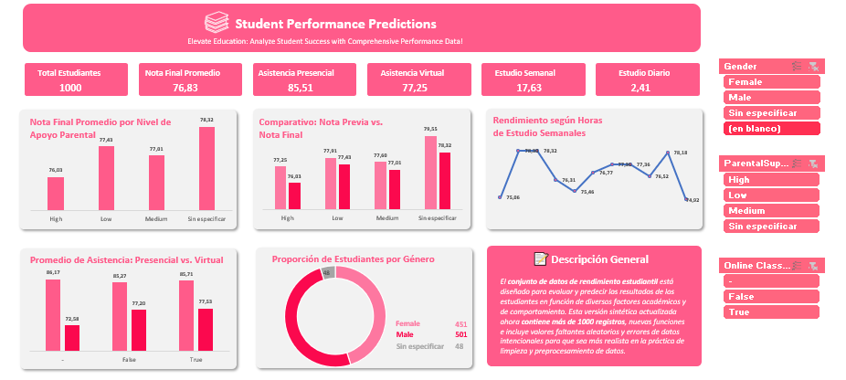

# 📊 Student Performance Analytics Dashboard

## 🛠️ Descripción del Proyecto

Este proyecto consiste en un **Dashboard Interactivo de Rendimiento Académico** desarrollado en Excel a partir del dataset público **[Student Performance Predictions](https://www.kaggle.com/datasets/haseebindata/student-performance-predictions)** disponible en Kaggle.

El objetivo principal fue transformar un conjunto de datos crudos e inconsistentes en un panel de control ejecutivo capaz de proporcionar insights accionables sobre los factores que influyen en el desempeño de los estudiantes (asistencia, hábitos de estudio, apoyo familiar y modalidad de clase).

---

## 🧹 Proceso de Limpieza y Preparación de Datos (Data Preparation)

El 80% del esfuerzo del proyecto se enfocó en garantizar la calidad e integridad de los datos antes del modelado visual:

1. **Delimitación y Estructuración:** Separación de columnas compuestas provenientes de la importación `.csv`.
2. **Estandarización de Tipos de Datos:** 
   * Conversión de variables numéricas guardadas como texto.
   * Corrección de separadores decimales (`.` a `,`) para garantizar compatibilidad con la configuración regional del sistema.
3. **Tratamiento de Valores Nulos (Data Imputation / Cleaning):** 
   * Identificación y eliminación controlada de registros con celdas vacías en variables críticas (`FinalGrade` y `AttendanceRate`) para evitar sesgos en el cálculo de promedios.
4. **Validación de Redundancias:** Análisis y categorización de métricas duplicadas para diferenciar variables semanales de métricas diarias y virtuales.

---

## 📈 Estructura del Dashboard y Métrica Clave

### 1. Tarjetas de KPIs Principales
* **Total Estudiantes:** Conteo único de alumnos analizados.
* **Promedio Nota Final:** Promedio general de calificaciones.
* **Asistencia Presencial Promedio:** Tasa de asistencia a clases físicas.
* **Asistencia Virtual Promedio:** Tasa de participación en clases online.
* **Horas de Estudio (Semanal vs. Diario):** Seguimiento de la dedicación de tiempo.

### 2. Componentes Visuales
* **Impacto del Apoyo Parental:** Gráfico comparativo de `FinalGrade` según el nivel de soporte en el hogar (*High, Medium, Low*).
* **Evolución Académica:** Gráfico de columnas agrupadas para medir el progreso entre `PreviousGrade` y `FinalGrade`.
* **Análisis de Hábitos:** Evaluación de la relación entre `StudyHoursPerWeek` y la calificación final.
* **Comparativa Presencial vs. Virtual:** Análisis del rendimiento según la modalidad de clase (`Online Classes Taken`).
* **Distribución Demográfica:** Gráfico de anillo por `Gender`.

### 3. Interactividad
* **Segmentadores Dinámicos (Slicers):** Filtros interconectados a todas las tablas dinámicas para analizar subgrupos por *Género*, *Apoyo Parental* y *Clases Online*.
* **Paleta Personalizada:** Diseño con estilo visual en tono `#FF657F` (Rosa Pastel) para optimizar la jerarquía visual y lectura.

---

## 🛠️ Herramientas Utilizadas
* **Excel:** Limpieza, transformación de datos, tablas dinámicas y diseño del Dashboard.

👤 Autor
[
